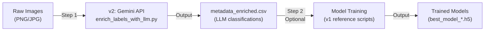
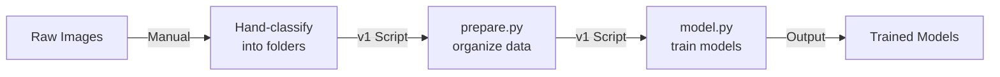

# Integration Guide: v1 and v2 Projects

This guide explains how the two versions of the skin image classification project work together and their relationship.

## Project Versions at a Glance

| Aspect | v1: skin-noise-detection | v2: skin-quality-qa |
|--------|--------------------------|----------------------|
| **Classification** | Manual (human review) | Automatic (LLM/Gemini) |
| **Status** | Legacy reference | ✅ Current (recommended) |
| **Input** | Raw images + manual labels | Raw images only |
| **Output** | Trained ML models | metadata_enriched.csv |
| **Effort** | High (manual) | Low (automated) |
| **Scalability** | Limited | Excellent |
| **Cost** | Free (time-intensive) | Free tier available |

---

## How They Work Together

### Scenario 1: Start-to-Finish (Recommended)



### Scenario 2: Legacy Approach (Reference Only)



---

## Step-by-Step Integration

### Stage 1: Image Classification (v2 - Automated)

**What happens**: Gemini API analyzes images automatically

```bash
cd skin-quality-qa

# Setup
cp .env.example .env
# ← Add your Google API key here

pip install -r requirements.txt

# Run LLM analysis
python -m src.enrich_labels_with_llm

# Output: data/metadata_enriched.csv
```

**Output structure**:
```csv
filename,blurry,hairy,bubble,ruler,vignette,gel_border
image_001.jpg,0,1,0,0,0,0
image_002.png,0,0,0,0,1,1
...
```

---

### Stage 2: (Optional) Model Training (v1 - Reference)

**What happens**: Train ML models on LLM-classified images

```bash
cd ../skin-noise-detection

# Setup
pip install -r requirements.txt

# Organize images by labels from metadata_enriched.csv
# into: datasetv2/blurry/, datasetv2/bubble/, etc.

# Prepare and split data
python src/prepare.py

# Train model
python src/model.py

# Compare models (optional)
python src/compare.py

# Analyze errors (optional)
python src/analyzeerrors.py

# Output: best_model_*.h5, final_comparison_results.csv
```

---

## Data Format Mapping

### v2 Output → v1 Input

The Gemini API (v2) produces binary artifact flags. Map them to v1's 5 categories:

```python
v2_output = {
    "blurry": 1,
    "hairy": 0,
    "bubble": 0,
    "ruler": 0,
    "vignette": 0,
    "gel_border": 0
}

# Maps to v1 category:
v1_category = "blurry"  # If any defect = 1, use that; if all 0, use "clean"
```

### Classification Rules

- **blurry**: blurry = 1
- **hairy**: hairy = 1
- **bubble**: bubble = 1
- **marked** (v1): ruler = 1 OR vignette = 1 OR gel_border = 1
- **clean** (v1): all artifacts = 0

---

## Key Dependencies

### v2 (LLM Classification)
```
google-generativeai>=0.3.0    # Gemini API
python-dotenv>=1.0.0          # .env file support
pandas>=2.0.0                 # Data handling
pillow>=10.0.0                # Image processing
```

### v1 (Model Training)
```
tensorflow>=2.13.0            # Deep learning
keras>=2.10.0                 # Neural networks
scikit-learn                  # ML utilities
opencv-python                 # Image processing
matplotlib/seaborn            # Visualization
```

---

## Configuration Reference

### v2 Configuration (skin-quality-qa/src/config.py)

```python
GOOGLE_API_KEY = "..."           # Required: Your Gemini API key

# Processing
DEFAULT_DAILY_LIMIT = 40         # Images/day (respects free tier)
REQUEST_DELAY = 6                # Seconds between requests
RETRY_ATTEMPTS = 5               # Retry failed requests
RETRY_DELAY_BASE = 30            # Base exponential backoff delay

# Paths
DATA_DIR = "./data"              # Image input directory
METADATA_CSV = "./data/metadata.csv"
METADATA_ENRICHED_CSV = "./data/metadata_enriched.csv"
```

### v1 Configuration (skin-noise-detection/src/model.py)

```python
IMAGE_SIZE = (450, 600)          # Input image dimensions
BATCH_SIZE = 32                  # Training batch size
EPOCHS = 30                       # Training iterations
LEARNING_RATE = 0.0001           # Optimizer learning rate
```

---

## Common Workflows

### Workflow A: Quick Classification Only
```
Raw Images
  ↓
[v2: LLM Analysis]
  ↓
metadata_enriched.csv (end here - no model training)
```

**Time**: ~10 minutes per 40 images  
**Use case**: Quick quality assessment without training models

---

### Workflow B: Full Pipeline (Recommended)
```
Raw Images
  ↓
[v2: LLM Analysis] → metadata_enriched.csv
  ↓
[v1: Data Preparation] → train/val/test split
  ↓
[v1: Model Training] → best_model_*.h5
  ↓
[v1: Error Analysis] → errors.txt, confusion_matrix.png
```

**Time**: 16 days LLM analysis + 2-4 hours model training  
**Use case**: Build production-ready classification models

---

### Workflow C: Legacy Manual Approach (Reference)
```
Raw Images
  ↓
[Manual Classification] → datasetv2/class1, class2, ...
  ↓
[v1: prepare.py] → organized data
  ↓
[v1: model.py] → trained models
```

**Time**: 2-3 weeks manual classification + 2-4 hours training  
**Use case**: Educational/legacy reference only

---

## Troubleshooting Integration Issues

### Issue: "metadata_enriched.csv not found"
**Cause**: v2 LLM analysis didn't complete  
**Solution**: 
1. Check API key in `.env`
2. Verify images exist in `data/train/`
3. Check logs for API errors
4. Ensure you have remaining API quota

### Issue: "No matching rows in metadata_enriched.csv"
**Cause**: Image filenames don't match between CSV and actual files  
**Solution**:
1. Verify `metadata.csv` has correct filenames
2. Ensure image names exactly match CSV entries (case-sensitive!)
3. Check file extensions (.jpg vs .JPG)

### Issue: Model training fails with "class not found"
**Cause**: Images not organized by v2 classification results  
**Solution**:
1. Parse `metadata_enriched.csv`
2. Copy/move images to matching class folders
3. Run `prepare.py` again

### Issue: "Low accuracy" in v1 models
**Cause**: May indicate issues with v2 classifications  
**Solution**:
1. Review `metadata_enriched.csv` - spot check a few classifications
2. Check v1 confusion matrices for patterns
3. Consider manual review of edge cases
4. Retrain v2 model with improvements

---

## Performance Expectations

### v2 (LLM Classification) Metrics
- **Processing Speed**: ~10 seconds per image (with 6s delays)
- **Accuracy**: ~85-95% (Gemini API reliability)
- **Cost**: Free (Google free tier: ~50 requests/day)
- **Throughput**: 40 images/day at free tier

### v1 (Model Training) Metrics
- **Training Time**: 2-4 hours per model (GPU-accelerated)
- **Accuracy**: 85-95% (depends on label quality)
- **Inference Speed**: <100ms per image
- **Resource**: ~4GB GPU memory recommended

---

## Next Steps

1. **Review both READMEs**:
   - [skin-quality-qa/README.md](./skin-quality-qa/README.md)
   - [skin-noise-detection/README.md](./skin-noise-detection/README.md)

2. **Check the complete workflow**:
   - [WORKFLOW.md](./WORKFLOW.md)

3. **Get your Google API key**:
   - [Google AI Studio](https://aistudio.google.com/app/apikey)

4. **Start with v2**:
   - Set up `skin-quality-qa` project first
   - Run LLM analysis on sample images
   - Verify quality of `metadata_enriched.csv`

5. **(Optional) Model Training**:
   - Use v1 reference scripts to train models
   - Evaluate performance
   - Deploy best model

---

## Summary

- **v2 (skin-quality-qa)** = Automated classification engine
- **v1 (skin-noise-detection)** = Model training reference  
- **Together** = Complete skin image analysis pipeline
- **Recommended** = Start with v2, optionally use v1 for training

---

**Questions?** Check individual project READMEs or WORKFLOW.md for detailed instructions.

**Last Updated**: January 2026
